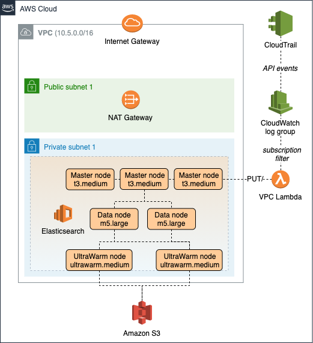

# Amazon Elasticsearch with UltraWarm - CDK Template

This is a CDK project to automate the creation of a basic Amazon Elasticsearch cluster with UltraWarm. This is for my own learning purposes. This is a test project and certain settings do not follow best practices for production usage. 

Read more about UltraWarm for Amazon Elasticsearch here:

* https://aws.amazon.com/blogs/database/retain-more-for-less-with-ultrawarm-for-amazon-elasticsearch-service/

## Architecture



This project deploys:

1. **VPC** a new VPC with a CIDR of 10.5.0.0/16 with two private and public subnets, one NAT Gateway, and an S3 VPC Endpoint.

1. **Elasticsearch cluster** - a new Elasticsearch cluster with three t3.small master nodes, one m5.large data node, and two ultrawarm.medium nodes (See Note 1). The one data node has a 50 GB storage volume. 

1. **CloudTrail** - configures a new trail to send all regional and global management event logs to a CloudWatch Logs group

1. **CloudWatch Logs** - a log group that receives logs from CloudTrail and has an [subscription filter](https://docs.aws.amazon.com/AmazonCloudWatch/latest/logs/SubscriptionFilters.html) to send all logs to a Lambda function

1. **Lambda function** - receives CloudWatch Logs via a subscription filter and uses the Elasticsearch PUT/ API to write the logs to an index named `cloudtrail-YYYYMMDD`, where `YYYYMMDD` is the event timestamp per the logs. 

**Note 1** - Ultrawarm can only be used when a cluster has master nodes (3 = minimum) and at least two ultrawarm nodes; also, it does not support data nodes of the T2/T3 type (at this time). The lowest cost data node outside of the T2/T3 nodes is the m5.large; similarly, this project deploys the lowest cost master and ultrawarm nodes available at the time of this writing (Nov 2020).

## Cost

The majority of cost will come from the Elasticsearch clsuter itself. For reference, cost in us-west-2 at time of writing is: 

```
  (three t3.small.elasticsearch master nodes) * ($0.036 / hour) * (744 hours / mo) ~= $ 80 / mo
+ (one m5.large.elasticsearch data node)      * ($0.142 / hour) * (744 hours / mo  ~= $106 / mo
+ (two ultrawarm.medium nodes)                * ($0.238 / hour) * (744 hours / mo) ~= $354 / mo
 ------------------------------------------------------------------------------------------------
                                                                                   ~= $540 / month ($17 / day)
 ```

Keep in mind, this estimate does not include the cost of CloudTrail, CloudWatch Logs, or the Lambda function... but they should be far lower. I've configured the CloudWatch log groups to only retain logs for one week to help keep log storage low. 

 ## Security

 The Elasticsearch cluster is deployed in a private subnet with a security group that allows all inbound traffic from the VPC CIDR (by default, `10.5.0.0/16`). In production, you might consider stricter security controls.

## Infrastructure Deployment

These instructions are my quick notes to myself. Their not in depth yet and assume you know your way around the AWS CDK.

1. Install and configure the AWS CLI and AWS CDK

1. Clone this project

1. From the project root, install Javascript dependencies for the CDK: `npm install`

1. Install Python dependencies for our Lambda function:

    1. Navigate to `~/lib/lambda/write-cloudtrail-to-es`
    1. Use pyenv and/or virtualenv to use Python version 3.8 (in my case, 3.8.6)
    1. Install Python dependencies: `pip install -r requirements.txt --target .`

1. Deploy the stack: `cdk deploy`

## Elasticsearch / UltraWarm Configuration

Once your cluster is deployed and you're able to connect to it, this section contains optional examples of how to use and test UltraWarm.

### Create an index policy for UltraWarm

The policy below migrates indices to UltraWarm after 6 hours and deletes them after 90 days:

```
{
    "policy": {
        "policy_id": "cloudtrail_policy_ultrawarm",
        "description": "Demonstrate a hot-warm-delete workflow.",
        "last_updated_time": 1604905614965,
        "schema_version": 1,
        "error_notification": null,
        "default_state": "hot",
        "states": [
            {
                "name": "hot",
                "actions": [],
                "transitions": [
                    {
                        "state_name": "warm",
                        "conditions": {
                            "min_index_age": "6h"
                        }
                    }
                ]
            },
            {
                "name": "warm",
                "actions": [
                    {
                        "timeout": "24h",
                        "retry": {
                            "count": 5,
                            "backoff": "exponential",
                            "delay": "1h"
                        },
                        "warm_migration": {}
                    }
                ],
                "transitions": [
                    {
                        "state_name": "delete",
                        "conditions": {
                            "min_index_age": "90d"
                        }
                    }
                ]
            },
            {
                "name": "delete",
                "actions": [
                    {
                        "delete": {}
                    }
                ],
                "transitions": []
            }
        ]
    }
}
```

### Automatically apply policy to new indices

```
PUT _template/cloudtrail_template
{
  "index_patterns": ["cloudtrail-*"],                 
  "settings": {
    "number_of_shards": 1,
    "number_of_replicas": 1,
    "index.lifecycle.name": "cloudtrail_policy_ultrawarm",
    "opendistro.index_state_management.policy_id": "cloudtrail_policy_ultrawarm"
  }
}
```